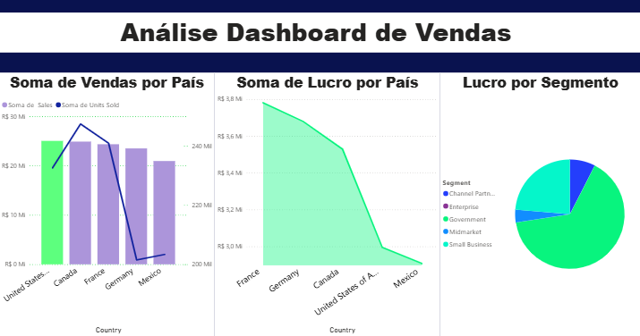

# Análise de Base de Dados de Vendas Global

## Objetivo
Analisar a distribuição dos dados de vendas globais, identificando quais países e segmentos de mercado geram o maior volume de lucro para a operação.

---

## Etapas Realizadas

### 1. Extração de Dados
Os dados brutos foram extraídos a partir do arquivo `Financial Sample.xlsx`, disponibilizado originalmente no repositório de referência: [julianazanelatto/power_bi_analyst](https://github.com/julianazanelatto/power_bi_analyst).

### 2. Transformação de Dados (ETL)
Limpeza e tratamento do dataset no Power Query, incluindo a correção de tipos de dados importados incorretamente pelo Power BI (como campos de valores monetários e formatação de datas).

### 3. Análise Exploratória de Dados (EDA)
Construção de relatórios visuais para identificação de padrões de comportamento das vendas em nível global, facilitando a interpretação dos resultados por meio de gráficos dinâmicos.

---

## Principais Insights e Conclusões

* **Performance por País:** Embora os Estados Unidos apresentem um volume expressivo de compras, a **França** se destacou como o país que gerou o maior lucro líquido para a empresa. Isso ocorre devido a uma estratégia eficiente de baixo índice de descontos aplicados nos produtos vendidos para o mercado francês.
* **Foco Estratégico por Segmento:** Os dados indicam que os investimentos devem ser priorizados nos segmentos de **Government (Governo)** e **Small Business (Pequenas Empresas)**, dado o alto retorno financeiro gerado.
* **Oportunidade de Melhoria:** O segmento de **Midmarket (Mercado Médio)** apresentou a menor margem e deve ser despriorizado ou revisto estrategicamente nas próximas campanhas.

---

## Visualização do Dashboard

---

## Desenvolvido por
Maria Luiza P Rezende
